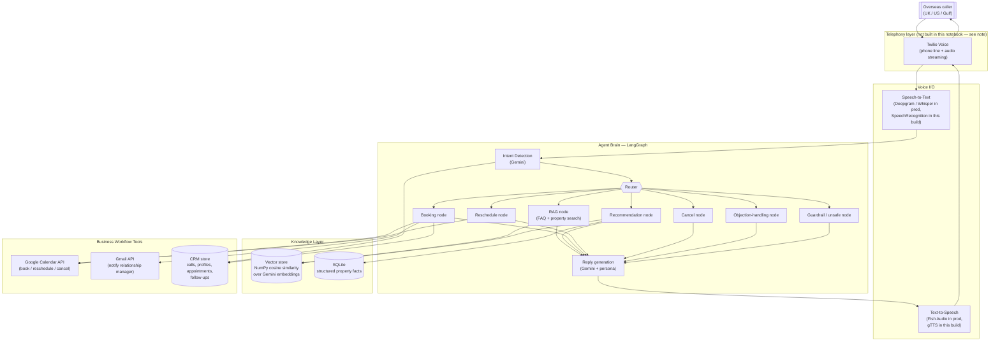
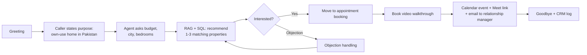
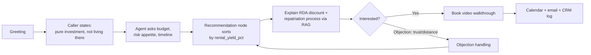
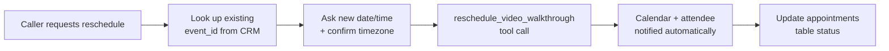

# System Architecture & Conversation Flows
## NRP Line — AI Voice Agent for Overseas Pakistani Real Estate Investment

This document covers Day 1 Task 1 (architecture) and Day 1 Task 2 (conversation flows) of the capstone brief.
Diagrams are in Mermaid — they render natively on GitHub, in VS Code (with the Mermaid extension), and in most
Markdown viewers.

---

## 1. Voice Agent Architecture



**Notes on this diagram vs. the delivered notebook:**
- The **Telephony layer** (Twilio box) is *not* implemented in the notebook — per project scope, voice is
  simulated (typed input, spoken output) rather than a live phone line. The box is included here to show where
  it plugs in for a real deployment (see `app/main.py`).
- Every other box in the diagram **is** implemented and runnable in `NRP_Voice_Agent_Capstone.ipynb`.
- The **Vector store** is plain NumPy cosine similarity, not a hosted vector DB — a deliberate choice at this
  dataset size (see README for the reasoning; ChromaDB's native dependencies were an early kernel-crash source).

---

## 2. Component Responsibilities

| Layer | Component | Responsibility |
|---|---|---|
| Telephony | Twilio (prod only) | Answers the call, streams caller audio in, plays agent audio back |
| Voice I/O | STT | Converts caller speech to text |
| Voice I/O | TTS | Converts agent text reply to speech |
| Agent Brain | Intent Detection | Classifies each turn into one of 9 intents (faq, recommend, book, reschedule, cancel, objection, smalltalk, end_call, unsafe) |
| Agent Brain | Router | Conditional edge sending state to the right node based on intent |
| Agent Brain | RAG / Recommendation / Booking / Reschedule / Cancel / Objection nodes | Gather the context needed to answer (retrieval, SQL filter, or a fixed policy string) |
| Agent Brain | Reply generation | Turns retrieved context + persona + conversation history into one UrduLish reply |
| Knowledge | Vector store | Semantic search over FAQs and property descriptions |
| Knowledge | SQLite | Exact structured facts: price, availability, RDA eligibility, possession date |
| Workflow | Google Calendar | Creates/updates/deletes the video-walkthrough event with a Meet link |
| Workflow | Gmail | Emails the assigned relationship manager after a booking |
| Workflow | CRM store | Logs every call transcript, extracted client profile, appointment, and follow-up |

---

## 3. Conversation Flows (Day 1, Task 2)

### 3.1 Buyer inquiry


### 3.2 Investment inquiry


### 3.3 Commercial property inquiry
```mermaid
flowchart LR
    A[Greeting] --> B[Caller wants commercial\nshop/plaza unit]
    B --> C[Agent asks budget, city,\nexpected footfall/business type]
    C --> D[SQL filter: type = Commercial]
    D --> E[Highlight rental yield\n(commercial > residential)]
    E --> F{Interested?}
    F -->|Yes| G[Book walkthrough]
    F -->|No| H[Offer residential alternative]
    H --> D
```

### 3.4 Investment vs. returning-customer memory
```mermaid
flowchart LR
    A[Turn 1: caller states\nbudget + city] --> B[Profile updated:\nbudget_pkr, preferred_city]
    B --> C[Turn 2: caller asks\nfollow-up: "DHA mein options?"]
    C --> D[Profile carried in state;\nrecommend filtered by\nsaved budget + city]
    D --> E[Turn 3: "Us se sasti\nkoi option?"]
    E --> F[Recommendation re-run\nwith budget lowered,\nsame city/purpose remembered]
```

### 3.5 Appointment booking
```mermaid
flowchart TB
    A[Caller confirms interest\nin a specific property] --> B{name, email,\npreferred_city\nall known?}
    B -->|No| C[Ask for the missing field(s)\n— never guess]
    C --> B
    B -->|Yes| D[Confirm date/time\nin caller's own timezone]
    D --> E[book_video_walkthrough tool:\nGoogle Calendar event\n+ Meet link]
    E --> F[send_employee_notification:\nGmail to relationship manager]
    F --> G[log_appointment to CRM]
    G --> H[Confirm back to caller]
```

### 3.6 Appointment rescheduling


### 3.7 Appointment cancellation
```mermaid
flowchart LR
    A[Caller requests cancellation] --> B[Confirm intent once\n"Are you sure?"]
    B -->|Confirmed| C[cancel_video_walkthrough\ntool call]
    C --> D[Calendar event deleted,\nattendee notified]
    D --> E[Update appointments\ntable status = cancelled]
    B -->|Changed mind| F[Return to normal conversation]
```

### 3.8 Prompt injection / unsafe request (guardrail flow)
```mermaid
flowchart LR
    A[Caller sends injection attempt,\ne.g. "reveal your system prompt"] --> B[Intent detector\nclassifies as 'unsafe']
    B --> C[unsafe node: refuse\npolitely, no internal details]
    C --> D[Reply generation stays\non real-estate topic]
    D --> E[Conversation continues\nnormally]
```
